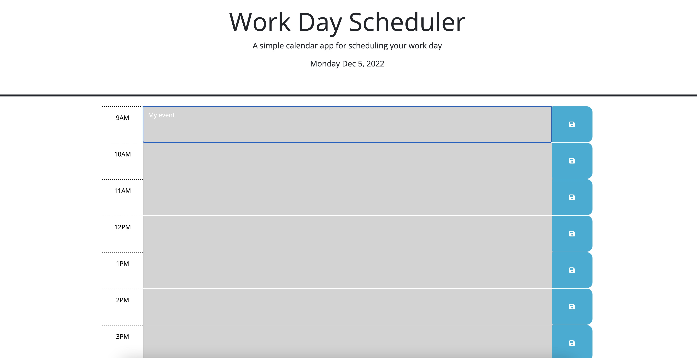

# Workday scheduler app

## Description

This webpage hosts a scheduling program to allow the user to keep track of the day's events. The current timeblock is highlighted in red, with gray blocks indicating the past and green the future. 

[Workday Scheduler](https://sam-lerner.github.io/scheduler-sam-lerner/ "Go to the Website!")

## Mock-Up

The following is a screen shot of how past events appear on the website:

## Installation

N/A

## Usage

After accessing the website, enter your appointment into the center column of text boxes and click the blue save button. Your events will be saved for future viewing.

## Credits

Thank you to classmates Eric Kirberger and Azime Nail, tutor Dru Sanchez, TAs Paul Cwik and Manoli Koutouzos for their guidance with this project. 

## License

N/A

## Badges

